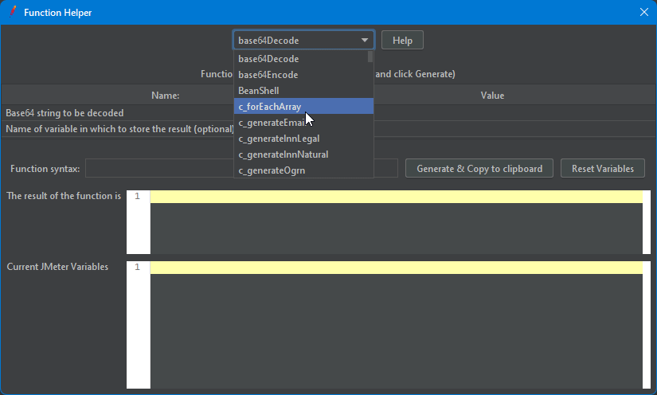
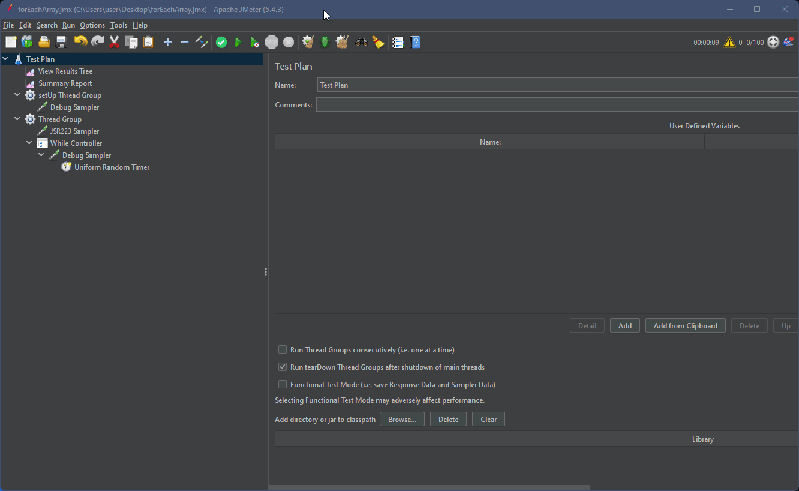
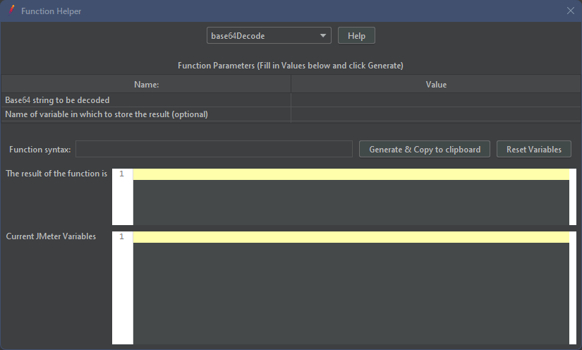
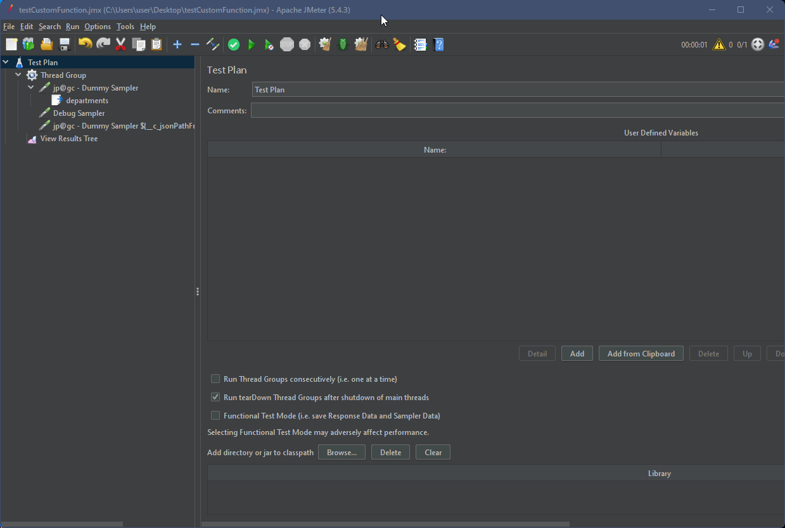
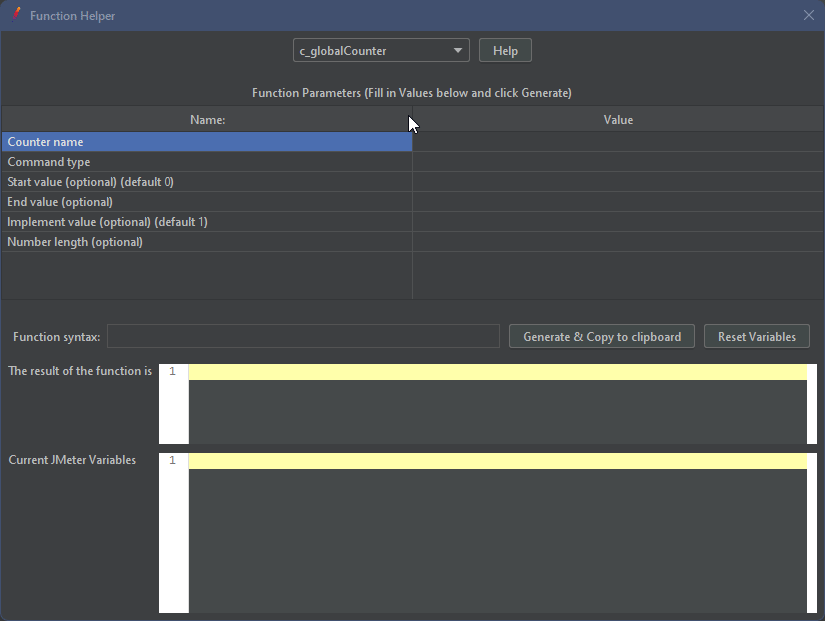
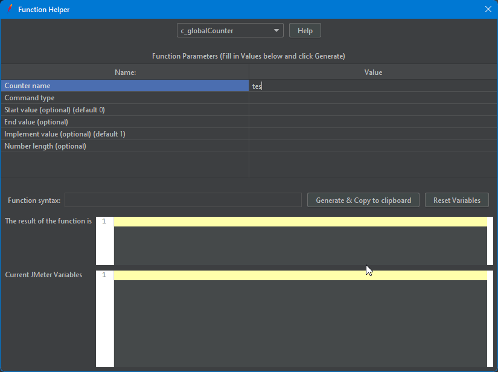
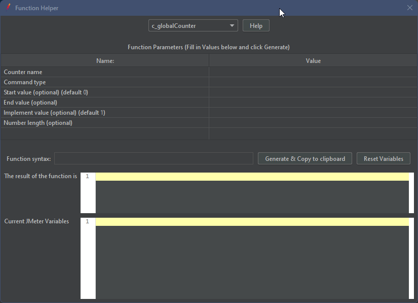
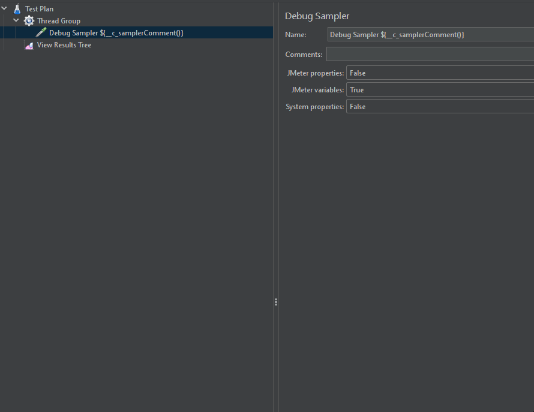

# Custom_jmeter_functions

Custom functions for jmeter

Ready-made functions:
- `forEachArray` - is a function for iterating over an array by calling a function. Each call to this function increments the index
  - parameters:
    - **Array or variable** - specifies an array or variable. If the variable is not found, it is converted into an array
    - **End value (default null) (optional)** - the value that will be returned when all elements have been processed
    - **For all threads (default false) (optional)** - a flag determining the array's scope
      - _true_: each thread can access the same array (synchronized is used)
      - _false_: a separate array is declared for each thread
    - **Command (clear, delete) (optional)** - special commands for interacting with the array storage
      - _clear_: remove all saved arrays
      - _delete_: remove only the specified array

    
    
---
- `generateEmail` - a function that generates an email
    - parameters:
        - **List domain(s) (use | as separator)**: a list of domains that will be randomly inserted at the end of the email
        - **Use chars in name email (Optional)**: list of characters to be used in generating the email name
        - **Minimum length of the email name (min 1) (Optional)**
        - **Maximum length of the email name (max 64) (Optional)**

    
--- 
 - `generateInnLegal` - a function that generates a valid INN for a legal entity

    
 ---
 - `generateInnNatural` - a function that generates a valid INN for a natural entity

    
 ---
 - `generateOgrn` - a function that generates a valid OGRN

   
 ---
- `generatePhoneNumber` - a function that generates a phone number
    - parameters:
        - **Country code(s) (use | as separator)**

  
---
- `generatePinCode` - a function that generates a PIN_CODE
    - parameters:
        - **PIN-code length**: specifies the length of the PIN code. If the length of the generated number   
          is less than the entered one, then the number will align to the entered length
        - **The minimum value allowed for a range of values (optional)**
        - **The maximum value allowed for a range of values (optional)**

  
---
 - `generateSnils` - a function that generates a valid SNILS

   
---
 - `jsonPathFromVar` - allows extracting values from a variable that stores JSON using JsonPath
   - parameters:
     - **Target variable** - a variable to which JsonPath will be applied
     - **JsonPath expression** - JsonPath expression ._.

   
---
 - `globalCounter` - Counter that is accessible anywhere in the TestPlan. It is possible to create multiple counters by assigning them names. The counter uses the synchronized modifier in its methods, which means that each time it is accessed, the retrieved value will be unique (for example, if 100 threads simultaneously access the counter, each will receive a unique value within the range). However, this also means potential slowdowns with a large number of threads (although this has not been tested yet)
   - parameters:
     - **Counter name** - unique name for the counter instance
     - **Command type** - command that defines the behavior of the counter when invoked
       - _addAndGet_
       - _getAndAdd_
       - _set_
       - _get_
       - _delete_
     - **Start value** -  initial value of the counter. It is set only when the counter is created and with the **set** command (can be negative)
     - **End value** - final value of the counter. When this value is reached (or exceeded), the counter will reset to the **Start value** (can be negative)
     - **Implement value** - value that will be added (can be negative)
     - **Number length** - format length of the counter

   **Load**
   
    **Add**
   
    **Start value & End value**
   
   **Errors**
   
---
 - `randomStringLiteral`:
   - parameters:
     - **List string literals (use | as separator)**
     - **Use a separator (Optional)**

   
---
 - `samplerComment` - a function that returns a comment of the element in which it is called. Like samplerName, only samplerComment

   
---
 - `timeRandom` - generates a random date within the specified range
   - parameters:
     - **Start time** - start date of the range
     - **End time** - end date of the range

     can be relative, for example: now; now-5m; now-10d, now+1y.
     - **Symbols**
       - **s** - seconds
       - **m** - minutes
       - **h** - hours
       - **d** - days
       - **w** - weeks
       - **M** - month
       - **y** - years
     - **Time format (default timestamp)** - the format in which the random date will be returned
    
   **Relative time**
   
   **Absolute time**
   
---
Version Jmeter: 5.4.3   
The Custom_functions-x.x.x.jar should be put in %jmeter%\lib\ext

